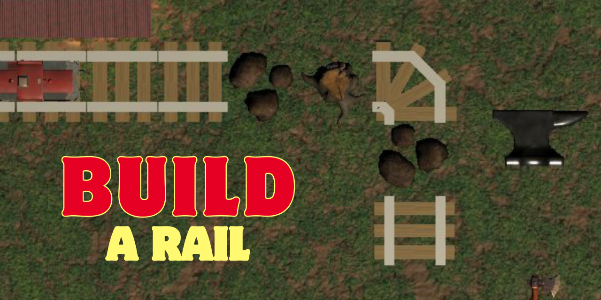
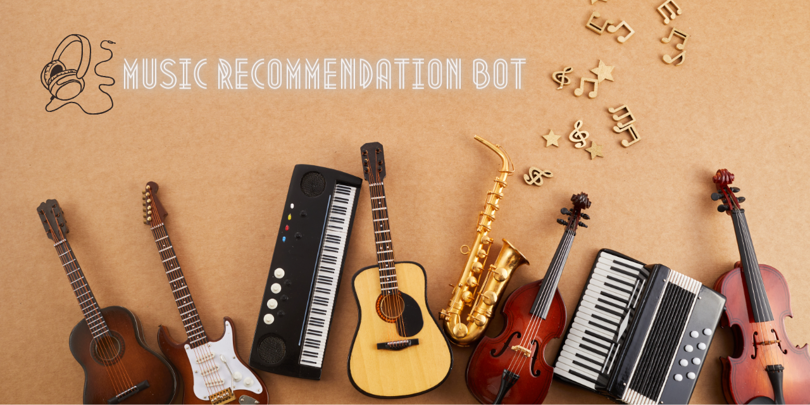
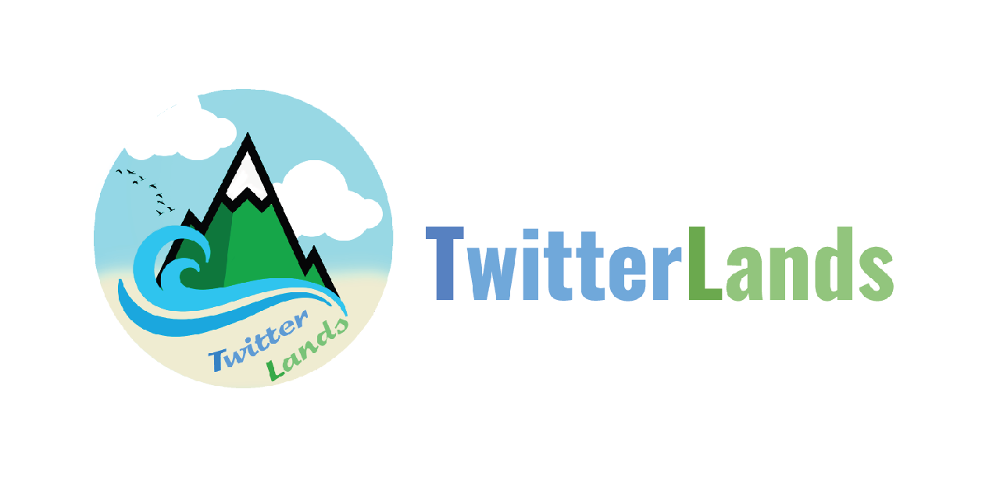
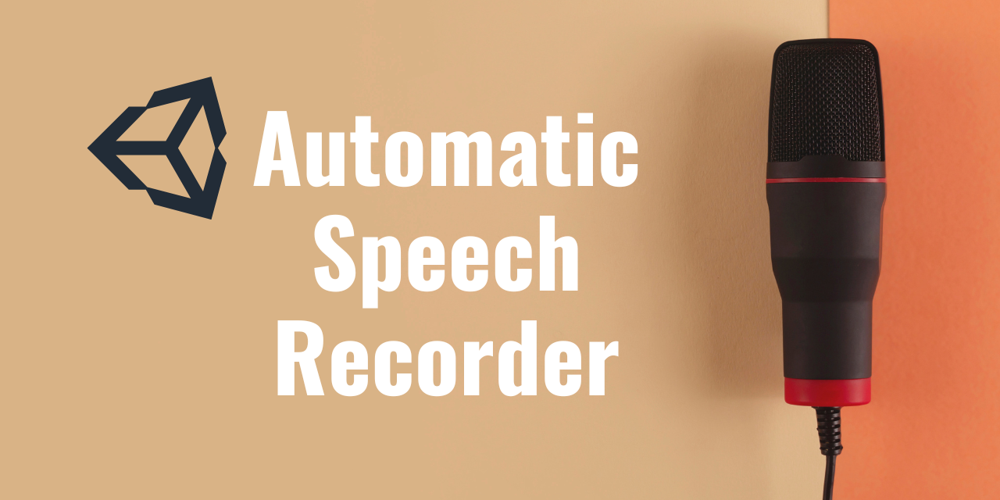
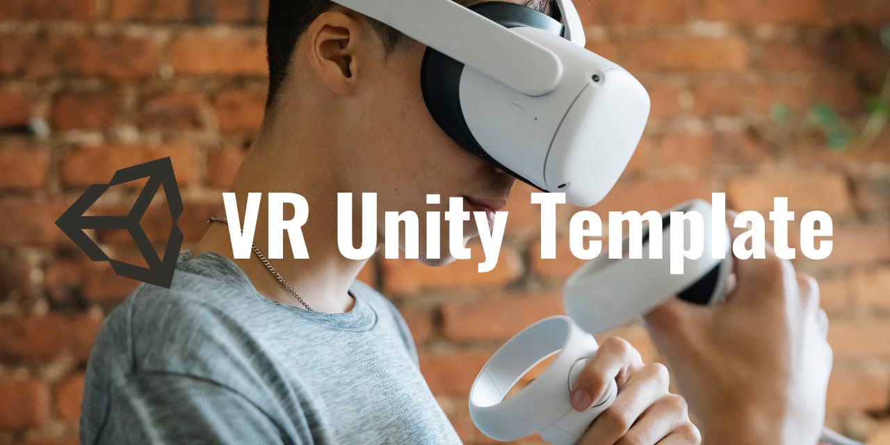
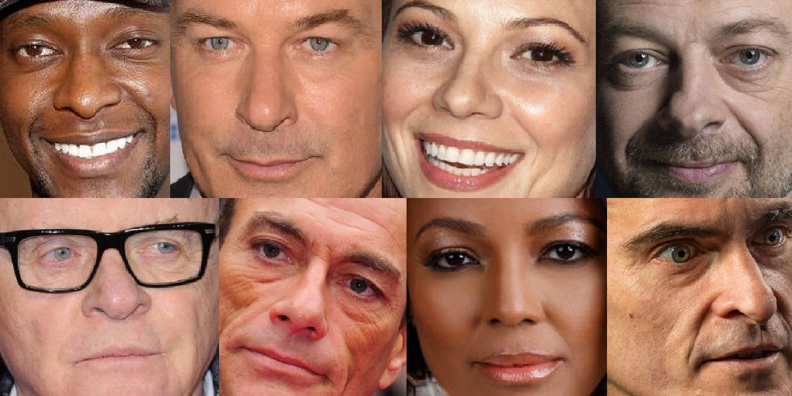

<h1 align="center">Hi there , I am Óscar</h1>

 

  

<a href="https://github.com/oscardelgado02/oscardelgado02/blob/main/learning_projects.md" target="_blank">Click to see projects I have done to learn new skills!</a>

##  Cool projects:

### 👓 XR experiences

<table>
<tr>
<td width="50%">
<h3 align="center">DragonIce   </h3>

DragonIce is a Full Body Interaction experience that works in the FuBIntLab (Universitat Pompeu Fabra) Mixed Reality environment. It was designed to promote and evaluate prosocial behavior in children with autism.

                                                                                      
</td>

<td width="50%">
 
<h3 align="center">AI NPC in VR Prototype   </h3>

                                       

 

VR prototype developed in Unity where the user can talk to an AI-driven NPC (ChatGPT API).

                                                             
</table>                                                                                 

 

<table>
<tr>
<td width="50%">
<h3 align="center">Build a rail   </h3>

Build a rail is a full body interaction collaborative videogame which its main objective is removing all the obstacles from the path between the train and the next station and creating new rails to put them in the empty places. This Unity Project works in the Mixed Reality environment from UPF Barcelona.

</table>
 

### 🎮 Videogames

<table>
<tr>
<td width="50%">
<h3 align="center">Get The Star - CPP 2D Game   </h3>

                                       

Get The Star is a 2D game DEMO made entirely with C++ where you need to play with gravity and magnetic forces to complete levels.

                                                                                      
</td>       

<td width="50%">
<h3 align="center">Stalkers - CPP 3D Game   </h3>

Stalkers is a 3D game DEMO made entirely with C++ where you need to find the exit gate to scape from a village that is full of monsters.

                                                                                      
</td>  
</table>                                                                                 

 

<table>
<tr>
<td width="50%">
<h3 align="center">Metro Madness   </h3>

Metro Madness is a game design project. The scripting is not as good as my recent projects (as it was one of my firsts Unity projects), but it is focused on the game design and finding a good ludonarrative harmony between the mechanics of the game and the message you want to share throught them.

                                                                                      
</td>

<td width="50%">
 
<h3 align="center">Sheep Rescue Mobile   </h3>

                                       

 

Sheep Rescue game (Introduction to Unity Scripting tutorial) adapted to mobile controls.

                                                             
</table>                                                                                 

 

### 🧠 Deep Learning

<table>
<tr>
<td width="50%">
<h3 align="center">Music Recommendation Bot   </h3>

Natural Language Processing Chat Bot that can recommend the user songs depending on the user mood and favourite genres.

                                                                                      
</td>

<td width="50%">
 
<h3 align="center">Signal Detection and Classification DL Model   </h3>

                                       

 

Deep Learning project that uses yolov5 to detect and classify traffic signals in videos.

                                                             
</table>                                                                                 

 

### 💻 Web development

<table>
<tr>
<td width="50%">
<h3 align="center">Twitter Lands   </h3>

Twitter Lands is a web page project that is really similar to Twitter, but it is organized by countries and users can add events and recommendations to each country.

</table>
 

### 🛠 Unity Tools for development

<table>
<tr>
<td width="50%">
<h3 align="center">Auto Speech Recorder For Unity   </h3>

An easy to use tool to automatically detect and record speech in Unity.

                                                                                      
</td>

<td width="50%">
 
<h3 align="center">Timers for Unity   </h3>

                                       

 

Unity Script to create and manage multiple timers.

                                                             
</table>                                                                                 

 

### ⌨ Code templates

<table>
<tr>
<td width="50%">
<h3 align="center">VR Unity Template   </h3>

Unity Template to start developing a VR application.

                                                                                      
</td>

<td width="50%">
 
<h3 align="center">CPP Solution For Visual Studio Code   </h3>

                                       

 

A working solution for Visual Studio Code to start programming in C++.

                                                             
</table>                                                                                 

 

### 💾 Datasets

<table>
<tr>
<td width="50%">
<h3 align="center">Face Dataset - 2400 IMG and 80 LABELS</h3>

Manually created and cropped dataset of 2400 images, 30 from each class, where each class is a famous person.

</table>
 

##  GitHub Stats:

