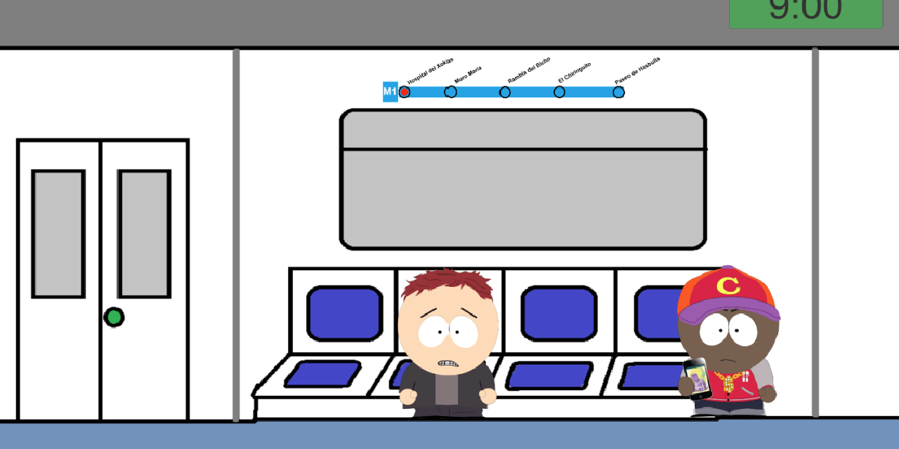

# Hi there , I am Óscar

 

##  Cool projects:
<table>
<tr>
<td width="50%">
<h3 align="center">DragonIce</h3>

DragonIce is a Full Body Interaction experience that works in the FuBIntLab (Universitat Pompeu Fabra) Mixed Reality environment. It was designed to promote and evaluate prosocial behavior in children with autism.

                                                                                      
</td>

<td width="50%">
 
<h3 align="center">AI NPC in VR Prototype</h3>

                                       

 

VR prototype developed in Unity where the user can talk to an AI-driven NPC (ChatGPT API).

                                                             
</table>                                                                                 

 

<table>
<tr>
<td width="50%">
<h3 align="center">Get The Star - CPP 2D Game</h3>

                                       

Get The Star is a 2D game DEMO made entirely with C++ where you need to play with gravity and magnetic forces to complete levels.

                                                                                      
</td>       

<td width="50%">
<h3 align="center">Stalkers - CPP 3D Game</h3>

Stalkers is a 3D game DEMO made entirely with C++ where you need to find the exit gate to scape from a village that is full of monsters.

                                                                                      
</td>  
</table>                                                                                 

 

<table>
<tr>
<td width="50%">
<h3 align="center">Metro Madness</h3>

Metro Madness is a game design project. The scripting is not as good as my recent projects (as it was one of my firsts Unity projects), but it is focused on the game design and finding a good ludonarrative harmony between the mechanics of the game and the message you want to share throught them.

                                                                                      
</td>

<td width="50%">
 
<h3 align="center">Sheep Rescue Mobile</h3>

                                       

 

Sheep Rescue game (Introduction to Unity Scripting tutorial) adapted to mobile controls.

                                                             
</table>                                                                                 

 

## 🛠️ My Tech Stack:

  

##  GitHub Stats:

##  Connect with me!

